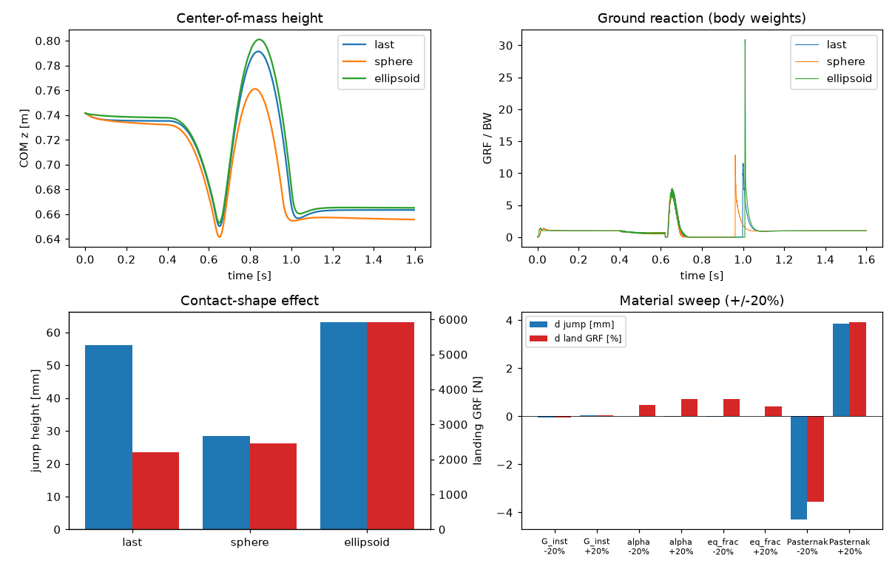

<!--
SPDX-FileCopyrightText: Copyright (c) 2026 The Newton Developers
SPDX-License-Identifier: Apache-2.0
-->

# Digital Instron v2

Identify one shoe-level effective viscoelastic midsole model from intact Digital
Instron bench tests, then exercise that calibrated model in live Newton
rigid-body physics.

## Calibration (`workflow.py`)

Fit the shared Hyperfoam-Maxwell-Pasternak column model to the rearfoot and
fullfoot bench cycles:

```bash
uv run -m projects.digital_instron_v2.workflow --manifest DigitalInstron/manifest_v2.json
```

The fitted parameters are cached at
`DigitalInstron/processed/v2_cache/digital_instron_material.json` and consumed by
the dynamic example below.

## Dynamic midsole example (`example.py`)

`dynamics.py` turns the calibrated column bed into a live Warp force model: each
substep every column reads its carrier-body pose, computes its through-thickness
compression, evaluates the Hyperfoam equilibrium pressure with a real-time
generalized-Maxwell overstress branch and Pasternak lateral coupling, adds an
anchored bristle (elastoplastic) Coulomb friction that holds a planted contact
patch and saturates at `mu * fn`, and accumulates the full six-component
ground-reaction wrench (normal, tangential shear, and the resultant moment that
carries the center of pressure) into `newton.State.body_f`. Four scenarios share
the same foundation:

```bash
# Displacement-controlled digital Instron: squish the midsole between a
# shoe-last crosshead and the ground plane; record the hysteresis loop.
uv run -m projects.digital_instron_v2.example --mode instron

# Free, massive midsole resting in stable equilibrium on the foundation;
# a sub-cone lateral load is held by the anchored stick-slip foam friction.
uv run -m projects.digital_instron_v2.example --mode settle

# Synthetic running stride that rolls a foot heel-to-toe over the foundation,
# producing a ground-reaction force profile and a migrating center of pressure.
uv run -m projects.digital_instron_v2.example --mode stride

# Fully dynamic, foot-mounted shoe with mass and inertia. A damped bilateral
# "upper" keeps the midsole coupled to the foot for the whole stride, so the
# shoe presses the foam into the ground in stance and the entire bed lifts clear
# with the foot in flight; the stance/flight ground reaction is recorded.
uv run -m projects.digital_instron_v2.example --mode attached
```

Add `--viewer null --num-frames N --test` to run headlessly and audit the
recorded response, or `--viewer gl` for the interactive viewer (the midsole
renders as a live bed of compression-coloured foam columns/springs that sink and
redden under load).

The `attached` mode is launch-overhead-bound (dozens of tiny per-substep kernel
launches for only ~600 columns, not compute), so it is optimised two ways. The foot
trajectory is precomputed once into device arrays and the per-substep force resets
are fused into a single kernel launch (each 1-element memset was otherwise a graph
node costing far more than the actual physics), leaving the whole 128-substep frame
fully on the GPU; that frame is then captured into a single CUDA graph and replayed
once per frame. Together these run the mode about 17x faster than eager launches
(~5 ms/frame on an A6000, several times faster than real time). Pass `--eager` to
disable graph capture for debugging.

## Jumping-leg crossover (`jump.py`)

`jump.py` puts the calibrated midsole under an articulated Newton leg and makes it
jump. A four-segment planar leg (vertical pelvis slider + hip/knee/ankle hinges,
built from `add_link`/`add_joint_*`) wears the fitted Hyperfoam-Maxwell-Pasternak
column bed as the sole of its foot; the foam is the only foot-ground contact and
its live six-component wrench is integrated by `SolverFeatherstone` alongside the
`joint_f` control torques. The sole interface is positioned from heel and toe
OpenSim `ContactSphere` geometry through the `projects.human_shoe` attachment
adapter, so the jump is also the contact-geometry integration test. A phase
controller drives a full
drop -> settle -> countermovement crouch -> push-off -> flight -> land cycle,
and the run reports jump height, per-joint work, and the drop/push/landing ground
reactions. The device-side control loop is captured into a CUDA graph (~30x faster
than eager, a couple of seconds per run on an A6000).

```bash
# Single jump; prints jump height, joint work, and ground-reaction peaks.
uv run -m projects.digital_instron_v2.jump --mode jump

# Watch the articulated leg and compression-coloured midsole live.
uv run --extra importers -m projects.digital_instron_v2.jump --mode jump --viewer gl

# Swap the sole underside (real shoe-last profile / sphere / ellipsoid) at
# fixed material and compare jump height, landing GRF, and joint work.
uv run -m projects.digital_instron_v2.jump --mode shapes

# Perturb each fitted foam parameter by +/-20% and report the jump/kinetic deviations.
uv run -m projects.digital_instron_v2.jump --mode sweep

# Render a summary figure (COM + GRF traces, shape and material-sweep bars).
uv run -m projects.digital_instron_v2.jump --mode shapes --figure figures/jump_summary.png
```

Two findings emerge, and together they motivate why the shoe is characterized on
a bench Digital Instron rather than inferred from whole-body motion:

* **Material stiffness/nonlinearity barely move gross mechanics.** Scaling the
  fitted instantaneous shear modulus, Hyperfoam exponent, or equilibrium fraction
  by +/-20% (even 100x) changes jump height and landing GRF by well under 1%: the
  thin, locally stiff midsole is a minor series compliance below the far more
  compliant musculoskeletal chain. Only the Pasternak lateral-coupling term is
  meaningful (~+/-4 mm jump, ~+/-4% landing GRF), because it redistributes load
  across the footprint.
* **Contact geometry dominates.** At identical material the real shoe-last sole
  jumps 56 mm, a sphere only 28 mm (its rocker cushions the push), and an
  ellipsoid 63 mm but with a ~6 kN landing spike (it concentrates the load on a
  narrow patch). The underside shape sets where and how the load concentrates,
  which the joints cannot compensate for.



## Tests

```bash
uv run --extra dev -m unittest newton.tests.test_digital_instron_core
uv run --extra dev -m unittest newton.tests.test_digital_instron_project
uv run --extra dev -m unittest newton.tests.test_digital_instron_dynamics
```

`test_digital_instron_dynamics` verifies that the live per-substep force
integration reproduces the calibrated `core.predict` model to float precision,
that the Pasternak neighbour table matches the calibration Laplacian operator,
and that each example scenario passes its physical audit.
